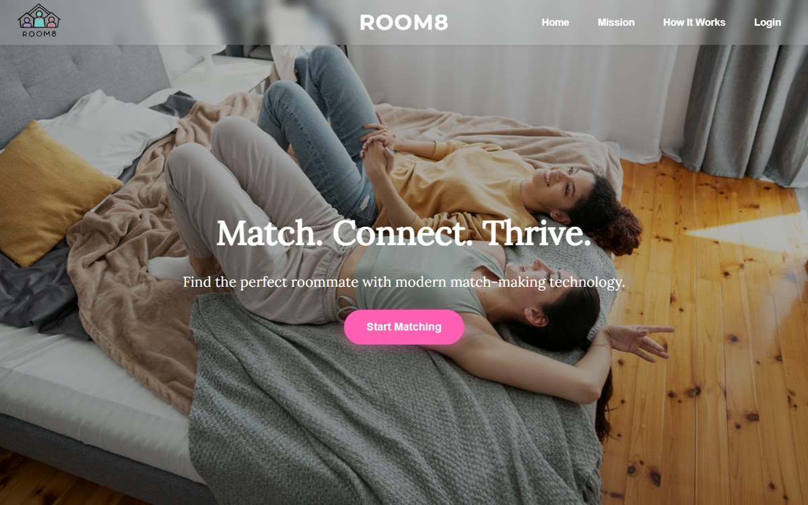
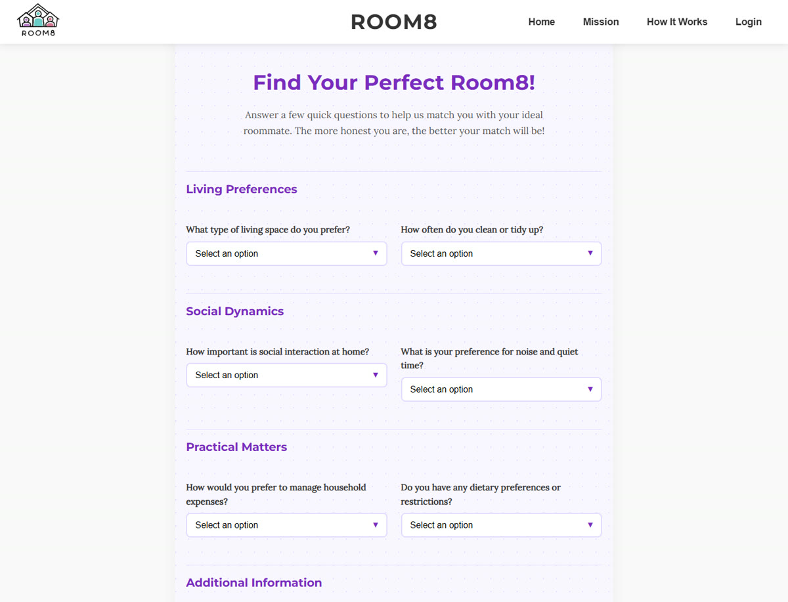

# Room8 (prototype)

**Match. Connect. Thrive.** Room8 is a roommate-matching web app concept: find the perfect roommate with modern matchmaking technology.

> Built in 2025 as a class project prototype. **I designed and built the entire user interface.**

<p align="center">

</p>

<p align="center">

<br/><sub>Landing page and the "Find Your Perfect Room8" matching questionnaire</sub>
</p>

## What I built

- **Landing page:** full-bleed hero image with the "Match. Connect. Thrive." headline and a "Start Matching" call to action
- **Purpose & mission sections:** explain why roommate fit matters, with a custom wavy section divider
- **How it works:** a step-by-step walkthrough that leads into matching
- **Sign-up, log-in, and "Find a Room8" matching form pages**
- **Responsive, mobile-first layout:** a hamburger nav menu and layouts tested at phone width
- **Brand identity:** logo, color palette (signature pink CTA buttons), and typography

## Tech

| Layer | Technology |
|---|---|
| Pages | Flask + Jinja templates (`templates/`) |
| Styling | Custom CSS, one stylesheet per page (`static/css/`) |
| Interaction | Vanilla JavaScript (`static/js/`) |
| Hosting (prototype) | Google Cloud App Engine |

## Run it locally

```bash
pip install -r requirements.txt
python app.py
```

Then open http://127.0.0.1:5000 (or the port shown in the terminal).

## Author

**Lilla Tillo**: UI design and front-end development (all pages, styles, and JavaScript). [GitHub](https://github.com/lilltill7) · lillabryar@gmail.com

Initial Flask project scaffold and Google Cloud deployment setup by Andy Tillo.
